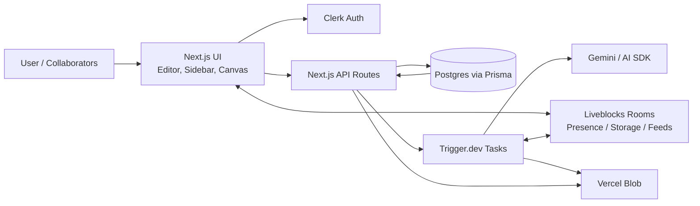

## 六つのコンテキストファイルで管理する

[[Ghost-ai/Six-File+Context+Methodology/templates/context]]に存在する

project rootにcontext folderを作成してプロジェクトの状態を管理する

それぞれの作業でspecs fileを作って作業させる（AIへの指示だしプロンプトを.mdで詳細に書く必要がある）

基本的には、開発をさせて違うブランチにコミットしてpushしてPR出してcoderabbitとかにレビューさせる流れが基本になる

APIを作る作業と、UIに接続する作業はプロンプトを分けることでより正しく実装できる

## 開発をする上でskillsを使う

prismaやclerkなどのはAgent skillsが公式から出ているのでそれらを導入して開発をすることで、スムーズに正しく開発できる

```bash
npx skills add clerk/skills
npx skills add prisma/skills
npx skills add liveblocks/skills
```

## 使ってる外部機能

- Liveblock: https://liveblocks.io/

## 全体アーキテクチャ

**Ghost AI** は、リアルタイム共同編集できる「システム設計ワークスペース」。

ユーザーは自然言語で作りたいシステムを説明し、AIエージェントがその内容を共有キャンバス上のアーキテクチャ図に変換する。チームメンバーは同じキャンバスで共同編集でき、最終的にその図と会話履歴からMarkdownの技術仕様書を生成できる。

### 2.1 技術スタック

| 領域 | 採用技術 | 役割 |
|---|---|---|
| Framework | Next.js / App Router | フルスタックWebアプリ基盤 |
| UI | React 19, TypeScript, Tailwind CSS, shadcn/ui | 型安全なUIとデザインシステム |
| Auth | Clerk | サインイン、ルート保護、ユーザー管理 |
| DB | Prisma + Postgres | プロジェクト、共同編集者、タスク、仕様書メタデータ |
| Realtime | Liveblocks | ルーム、プレゼンス、共同編集、フィード |
| Canvas | React Flow / XY Flow | ノード・エッジベースの設計キャンバス |
| Background Jobs | Trigger.dev | AI生成・仕様書生成など長時間処理 |
| AI | Vercel AI SDK + Gemini / OpenRouter代替可 | アーキテクチャ生成、仕様書生成 |
| Object Storage | Vercel Blob | Canvas snapshot、Markdown spec本体 |
| Review | CodeRabbit | PRレビュー、仕様不足・不具合検出 |
| Deploy | Vercel | 本番ホスティング |

### 2.2 レイヤー構成



### 2.3 重要な設計不変条件

動画内で繰り返し守られている設計ルール。

1. **長時間AI処理をAPI route内で直接実行しない**
   - API routeはTrigger.dev taskを起動してすぐ返す。
   - 実処理はdurable background taskで行う。

2. **巨大データをDBに詰め込まない**
   - Postgresはmetadata中心。
   - Canvas JSONやMarkdown spec本体はVercel Blobへ保存。

3. **認証・所有権チェックはserver-sideで必ず行う**
   - UIで非表示にするだけでは不十分。
   - API mutation境界でowner/collaborator権限を検証する。

4. **Liveblocks room tokenはプロジェクトアクセス検証後に発行する**
   - Liveblocks roomはデフォルトでopenになりがち。
   - Ghost AIではmembership確認後にtokenを返す。

5. **AIには既存アプリの機能を再利用させる**
   - AI生成は新しい描画システムを作らず、既存のノード追加・移動・更新・削除機能を呼ぶ。

6. **client componentは必要な場所だけに限定する**
   - 初期データ取得はserver componentで行う。
   - インタラクションやLiveblocks接続が必要な部分だけclient化する。


```
┌─────────────────────────────────────────┐
│             Project                     │
├─────────────────────────────────────────┤
│ id              String   PK             │
│ ownerId         String   ← Clerk userId │
│ name            String                  │
│ description     String?                 │
│ status          Status   (DRAFT|ARCHIVED)│
│ canvasJsonPath  String?                 │
│ createdAt       DateTime                │
│ updatedAt       DateTime                │
├─────────────────────────────────────────┤
│ @@index([ownerId])                      │
│ @@index([createdAt])                    │
└──────────────┬──────────────────────────┘
               │ 1
               │
               │ collaborators (onDelete: Cascade)
               │
               │ N
┌──────────────┴──────────────────────────┐
│        ProjectCollaborator              │
├─────────────────────────────────────────┤
│ id          String   PK                 │
│ projectId   String   FK → Project.id    │
│ email       String                      │
│ createdAt   DateTime                    │
├─────────────────────────────────────────┤
│ @@unique([projectId, email])            │
│ @@index([email])                        │
│ @@index([projectId, createdAt])         │
└─────────────────────────────────────────┘
```

関係性のサマリ

```
 Clerk User ──(ownerId)──▶ Project ──1:N──▶ ProjectCollaborator
                            │                       ▲
                            └── cascade delete ─────┘
```

- `Project.ownerId` は Clerk の userId をそのまま入れる外部参照（DBにはFKなし）
- `ProjectCollaborator.projectId` は `Project.id` への FK で **cascade delete**
- `(projectId, email)` で一意制約 → 同じ人を二重招待できない
- インデックスは検索系（owner一覧 / email検索 / プロジェクト別の招待履歴順）に効く配置


## Spec-driven AI開発方法論

### 3.1 6ファイルのコンテキストシステム

プロジェクト直下に `context/` を作り、AIエージェントが常に参照する文脈を保存する。

```text
context/
  project-overview.md
  architecture.md
  code-standards.md
  ai-workflow-rules.md
  ui-context.md
  progress-tracker.md
  feature-specs/
    01-design-system.md
    02-editor-layout.md
    ...
```

| ファイル | 目的 |
|---|---|
| project overview | 何を作るか、誰が使うか、コアフロー、スコープ外 |
| architecture | 技術スタック、レイヤー境界、守るべき不変条件 |
| code standards | TypeScript / Next.js / 命名 / import / component規約 |
| AI workflow rules | AIがどう作業するか、勝手に広げないルール |
| UI context | デザイントークン、色、余白、UIトーン |
| progress tracker | 完了済み、進行中、設計判断、セッションメモ |

### 3.2 `agents.md` / `claude.md` の役割

AIエージェントが最初に読む入口ファイルとして、以下を指示する。

- 実装前に6つのcontext fileを順に読む
- feature specを読む
- progress trackerを更新してから実装する
- 実装後もprogress trackerを更新する
- 指定スコープ外に出ない

### 3.3 Feature specの単位

動画では大きな機能を一括でAIに任せず、**1回の集中セッションで実装できる単位**に分ける。

各specには以下を含める。

- Goal
- Design decisions
- Implementation details
- Dependencies
- Done checklist
- Out of scope
- Verification steps

### 3.4 AIへの基本プロンプトパターン

```text
Read this feature spec.
Update the progress tracker and mark this unit as in progress.
Implement it exactly as specified.
Do not go beyond scope.
When done, run checks and update the progress tracker.
```

この形式により、チャット本文は短くても、spec fileが実質的な指示書として働く。

### 3.5 エラー修正のパターン

エラーが出たら即「fix it」と投げない。

1. `current-issues.md` に状況、エラー、再現手順を書く
2. AIに「まず分析と修正案を出して」と依頼する
3. 人間が方針を確認する
4. 実行させる
5. 再検証する

これにより、AIが自己修正の連鎖で別の箇所を壊すリスクを下げる。
